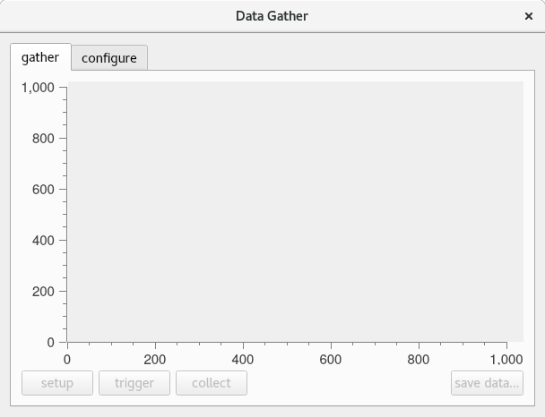

Data Gather
===========

A data gather collects data for a particular motor variable over a specified length of time. This data can be plotted and saved for future reference.

Configure Gather
----------------

The user can configure a data gather from the "config" tab of the gather window.

.. figure:: gui_images/data-gather-config.png
  :width: 600

  *Data Gather Configuration*

To configure a data gather the user must first define the number of samples and the sample time. The number of samples is the total number of data points to sample for the gather. The sample time is the number of servo cycles between sample points. To set these values the user must enter the values in the edit boxes and hit enter to update the values. Once these values have been updated a signal length (total time for gather to complete) and sample frequency will be displayed.

Next the user must choose the data to be gathered. Up to five gather channels can be specified for each gather. To configure a single gather channel:

#. Click the checkbox
#. Select the motor number
#. Choose whether to plot from the left-hand-side or the right-hand-side
#. Choose a colour for the plot
#. Choose which variable to gather 
#. Click apply

Setup Gather
------------

  *caption*

Now go to the "gather" tab and click setup.

Trigger Gather
--------------

Press "trigger" button to send a gather command to the controller. Once the gather has completed the user will be able to collect the data.

Collect Data
------------

Once the data gather is complete and the "collect" buttton is enabled click this to plot the data. For the PMAC, the gathered data is collected directly from the gather buffer. For the Power PMAC, the gathered data is sent to a file on the controller and this is then copied over to the local machine. 

Save Gathered Data
------------------

The user may wish to save the data that has been gathered. To do this click the "save data..." button and specify a file location and a file name.
