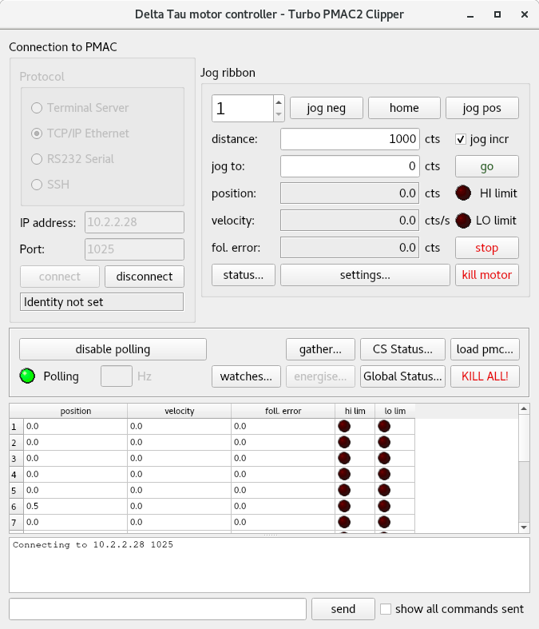

Main GUI Screen
===============

Running the application will launch the following screen:

.. _label_main:
.. figure:: gui_images/main-window-startup.png
  :width: 600
  :alt: Initial GUI screen

  *GUI startup*

Connection
----------

To connect to the hardware select the connection type and press connect. There is the option of changing the connection parameters if required. 

When connecting via SSH protocol, the default username and password will be used and if this fails then the following screen (:numref:`label-login`) will be shown to promt the user for another username and password:

.. _label-login:

.. figure:: gui_images/login.png
  :width: 400
  :alt: screen to prompt user for SSH authentication

  *Login screen to prompt user for SSH authentication*

Upon successfully connecting the application will launch a screen similar to the following:

.. _label_connected:

  *GUI immediately after connecting*

Jog Ribbon
----------

The jog ribbon can be found within the main screen and allows the user to move individual motors. The jog ribbon also shows the position, velocity, and following error of the current motor and shows LEDs which indicate whether a position limit has been reached. Note that for the Power PMAC these LEDs will be red when hardware limits have been reached and amber when software limits have been reached (LEDs are always red for PMAC as there is no distinction between hardware and software limits).

Axis Settings
-------------

To configure the settings for a particular axis press the "settings..." button in the main screen. This will launch the following screen which has two tabs for PMAC models:

.. figure:: gui_images/pmac-axis-settings.png
  :width: 400

  *caption*

.. figure:: gui_images/pmac-axis-settings2.png
  :width: 400

  *caption*

The values shown on this screen can be edited by typing in new values and pressing enter. This will send a command to the hardware to set the variable to the desired value. It is expected that new values are in a format which can be interpreted by the PMAC and within an allowed range for that variable. Unlike in the polling table, values do not update periodically, instead the user must click update to read back values from the PMAC.

For the Power PMAC the axis settings screen is as follows:

.. _fig-ppmac-settings:

.. figure:: gui_images/power-pmac-axis-settings.png
  :width: 400

  *caption*

The screen shown in :numref:`fig-ppmac-settings` can be used in the same way as for the PMAC.

Status Screens
--------------

Polling
-------

The polling table shows the position, velocity, and following error of all the motors and shows LEDs which indicate whether a position limit has been reached. Note that for the Power PMAC an amber LED indicates a software limit and a red LED indicates a hardware limit.

Sending Commands
----------------

The application includes the option to send commands directly to the PMAC using the bar at the very bottom of the main window. The checkbox labelled "show all commands sent" allows the option of displaying any commands sent by any other parts of the application. For example, when using the jog ribbon, if this box is ticked then any commands sent to the controller will be displayed in the command window.

Loading PLCs
------------

The application allows the user to load a PLC line-by-line onto the PMAC. Note that if the PLC cannot be interpreted by the controller then the application may freeze while loading the PLC.
