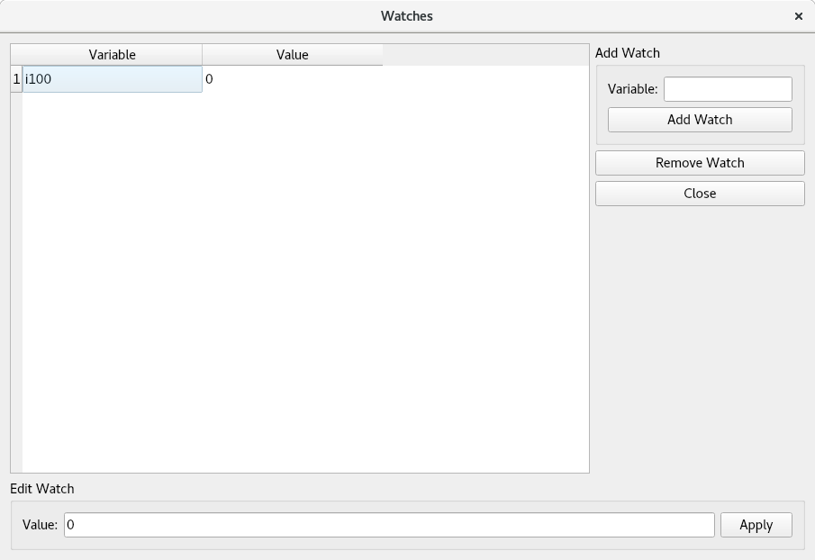

Watch Window
============

The watch window enables the user to specify particular variables to monitor. To launch the watch window click the "watches..." button on the main GUI screen. The watch window will initally be as follows:

.. figure:: gui_images/watch-window.png
  :width: 600

  *Watch window*

Adding a watch
--------------

To add a watch, type the name of the variable in the text box in the upper right-hand side of the screen and click "Add Watch". The variable should now appear in the table with it's current value displayed. The value will be updated periodically at the polling frequency. 

Removing a watch
----------------

To remove a watch from the table click on the watch and then click "Remove Watch".

Editing watches
---------------

  *Editing a watch*

When the user clicks on a watch in the table, the "Edit Watch" box at the bottom of the screen will be enabled. This allows the user to type a new value into the box and then when the user clicks "Apply" a command will be sent to the PMAC to update the value for the particular watch variable. This new specified value must be in a format which can be interpreted by the controller otherwise the value will not be updated as expected.
